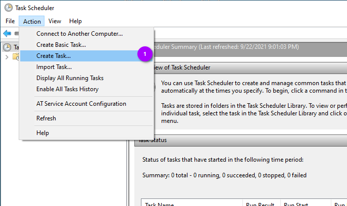
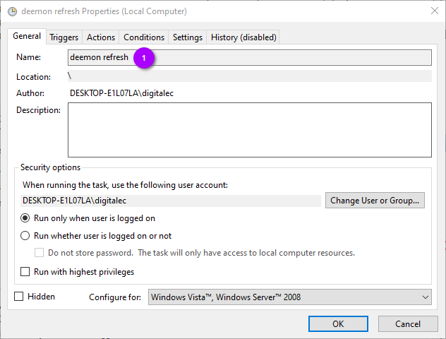
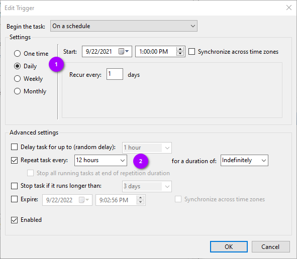
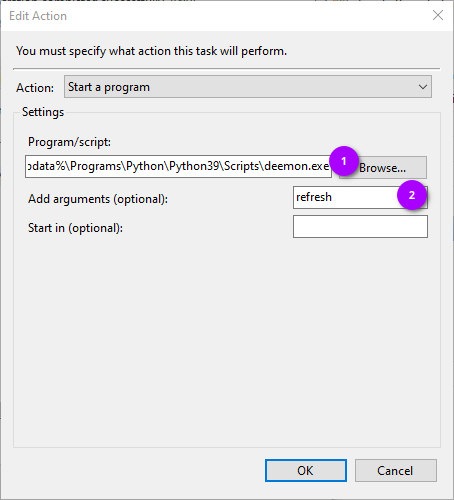

# Task Scheduler
{: .no_toc }

## Table of contents
{: .no_toc .text-delta }

1. TOC
{:toc}

---

## Create a New Task

Inside Task Scheduler, select the **Action** menu button and click _Create Task..._

## Name the Task

Give the task a name so you'll know what it's for. In this case, this task will be setup to run
`deemon refresh` so that's what I've named it.

## Setup the Schedule

This is where Task Scheduler becomes a little cumbersome. If you want to run a task every few minutes/hours, 
you have to select _Daily_ (1) and under _Advanced settings_ check the box to repeat the task (2). The drop down 
box for _Repeat task every:_ doesn't give many options, but thankfully you can type in your preference. I went 
ahead and put in _12 hours_ with a duration of _indefinitely_.

With these settings, our task will run every 12 hours until we disable it.

## Set the Application and Arguments

Under _Program/script_ (1) we need to set the **absolute path** to deemon:

`_%localappdata%\Programs\Python\Python39\Scripts\deemon.exe`

Under _Add arguments (optional)_ (2) is where you put the deemon command you wish to run. Since this task is being 
setup for doing a refresh, we only need to put _refresh_ in this box. When Task Scheduler runs this task, it would be 
the equivalent of typing `deemon refresh` at a command prompt.

## Configure Task Settings

Here you can configure your various preferences with how to handle various situations/conditions. The most important 
ones are:

(1) _Allow task to be run on demand_

(2) _Run task as soon as possible after a scheduled start is missed_ 

This will allow us to manually run the task to test it and will also run the task if your computer was off or sleeping 
the last scheduled run.
