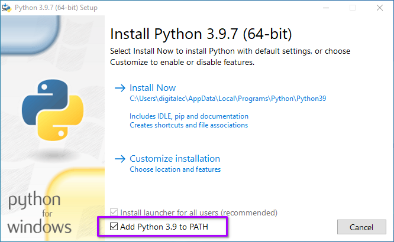

# Installation
{: .no_toc }

## Table of contents
{: .no_toc .text-delta }

1. TOC
{:toc}

---

## Linux & macOS

*The instructions below were written for Linux but should work the same for 
modern versions of macOS as well.*

### Step 1 - Installing Python
Most modern Linux distributions come with Python 3 pre-installed. deemon 
requires Python 3.6+ so make sure you're up 
to date on your packages. Depending on your system, you may use `python` or 
`python3` to run Python:

##### Debian 10:
```bash
$ python -V
Python 2.7.16

$ python3 -V
Python 3.7.3
```

##### Manjaro 21.1.3:
```bash
$ python -V
Python 3.9.7
```

### Step 2 - Installing deemon
Once you have at least Python 3.6 installed, go ahead and install deemon using 
`pip`. On some distributions, the `pip` command is for Python2. In this case, 
substitute `pip` for `pip3` in the command below:

```bash
# Latest stable release
$ pip install deemon

# Latest beta release
$ pip install --pre deemon
```

At this point, pip will download deemon and any other modules required to allow 
deemon to function. Once it's complete, use the following command to make sure 
deemon installed:

```bash
$ deemon -V
deemon 2.0
```

## Windows

### Step 1 - Installing Python
Python is required to run deemon and can be downloaded from 
[python.org](https://www.python.org/downloads/windows/)

On the initial installer screen, be sure to check the box next to _Add Python 
x.x to PATH_:



To make sure you have Python properly installed, open a command prompt and 
type: `python -V`. You should see it print out the version of Python you have 
installed:

```bash
C:\> python -V
Python 3.9.7
```

If you don't see this or you see some type of error message, you may need to 
close **ALL** open command prompt windows and reopen them. As a last resort, 
reboot your PC.

### Step 2 - Installing deemon
Now that you've got Python installed, we're going to install deemon using 
`pip`. In a command prompt, type:

```bash
# Latest stable release
C:\> pip install deemon

# Latest beta release
C:\> pip install --pre deemon
```

At this point, pip will download deemon and any other modules required to allow 
deemon to function. Once it's complete, use the following command to make sure 
deemon installed:

```bash
C:\> deemon -V
deemon 2.9
```

## Configuration & First Use

Congrats! If you've made it this far, you have successfully installed deemon. 
There are a few things you should configure before using deemon. Head on over 
to the [configuration](configuration.md) page to learn more.